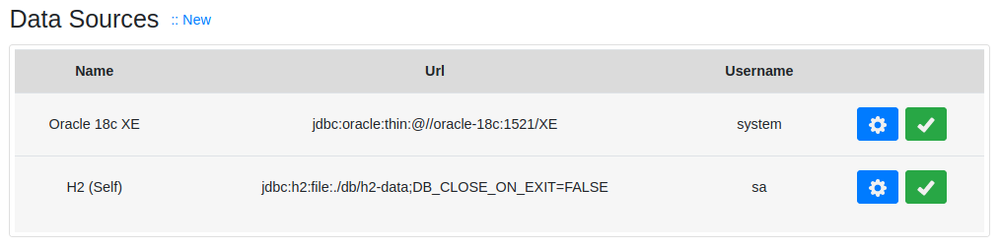
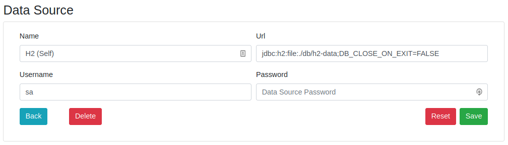
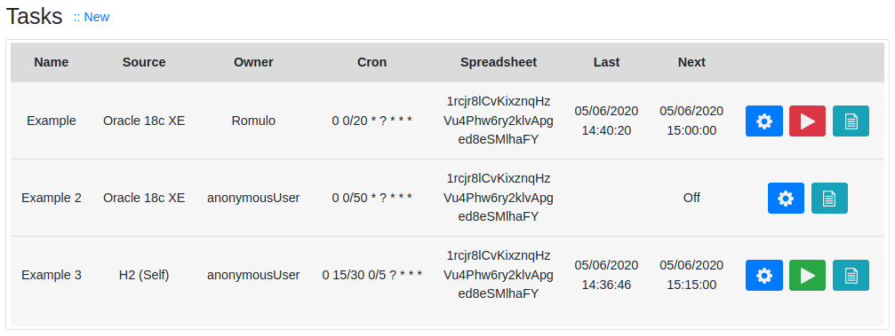
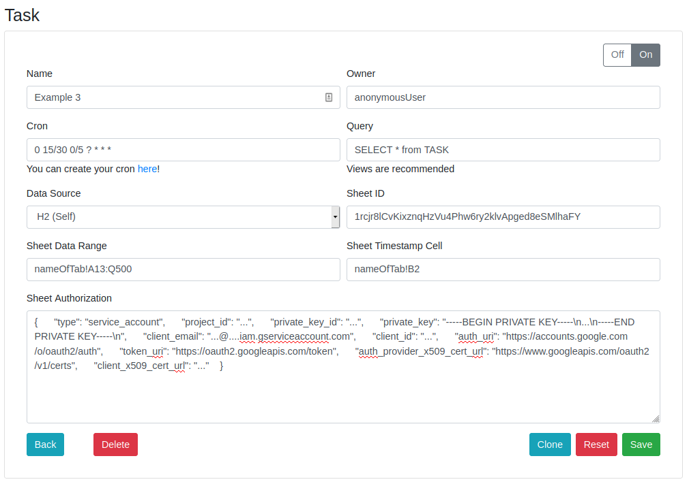
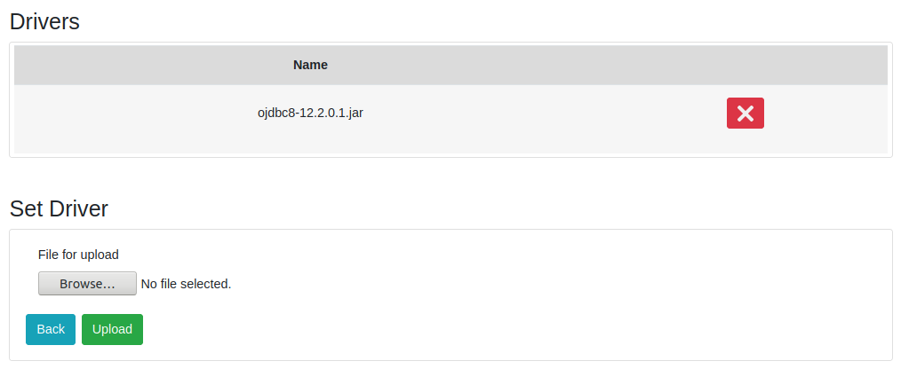

# Sql 2 Sheets

Spring + Quartz application that connects to
a relational database, executes a sql query and
pushes the result to a Google Spreadsheet.

The database driver must be provided.

> Java 14; Spring Boot; Web Security; JPA Hibernate; Thymeleaf;
Bootstrap; JQuery; Quartz; LDAP; Google API / Spreadsheets;
Lombok; H2

## Application Configuration

+ Java 14 and Maven 3.6
+ Configure the `lib/` folder as project library in the IDE. 
The drivers can be put in this folder or uploaded on Application's 
frontend.

Authentication modes (application.yml):
* NONE: No authentication at all
* IN_MEMORY: Simple single user authentication (insecure)
* LDAP: Authentication with an external LDAP Server

Docker environment variables will overwrite the application.yml 
auth configuration (Default NONE). Short examples of a LDAP and a IN_MEMORY 
configurations in docker-compose.yml:
```
version: '3.7'

services:
  sql2sheets:
    image: rbritta/sql2sheets
    container_name: sql2sheets
    environment:
      SPRING_LDAP_URLS: ldap://ldap.company.com:389
      SQL2SHEETS_AUTHENTICATION_TYPE: LDAP
      SQL2SHEETS_AUTHENTICATION_LDAP_DOMAIN: dc=company,dc=com
```
```
version: '3.7'

services:
  sql2sheets:
    image: rbritta/sql2sheets
    container_name: sql2sheets
    environment:
      SQL2SHEETS_AUTHENTICATION_TYPE: IN_MEMORY
```
The username and password for IN_MEMORY mode are admin/admin.
These are not parameterized, nor have a CRUD yet.

### Data Sources


### Data Source Editor


### Tasks


### Task Editor


### Drivers


## Google Sheets Configuration

To allow access to the spreadsheet, it's required a project 
and credential setup in the Google Developers console:
`http://console.developers.google.com`

Create a "Service Account" credential and get a Json Token. The
json content will be used in `Sheet Authorization` field while
creating a Task see [Task Editor](#task-editor) image.

Share the spreadsheet with the Service Account email.

## Deploy

### Docker (19.03)

See `Dockerfile` and `docker-compose.yml` files in this project.

[Docker image](https://hub.docker.com/r/rbritta/sql2sheets) at hub.docker.com\
[Source code](https://github.com/rbritta/sql2sheets) at github.com

You can also create volumes for `/sql2sheets/lib` (drivers) and `/sql2sheets/db` (h2 file) directories, making
easier backups and container upgrades, e.g.:
```
version: '3.7'

services:
  sql2sheets:
    image: rbritta/sql2sheets
    container_name: sql2sheets
    ports:
      - 8080:8080
    volumes:
      - /data/sql2sheets/db:/sql2sheets/db
      - /data/sql2sheets/lib:/sql2sheets/lib
    environment:
      TZ: America/Sao_Paulo
    logging:
      options:
        max-size: "10m"
        max-file: "1"
    restart: unless-stopped
```
**Attention**: Probably the container won't be allowed to access the `/data/sql2sheets` directory,
so you can change the ownership to the user 1028 (Defined in Dockerfile): \
`sudo chown -R 1028:1028 /data/sql2sheets`

If your container needs direct access to others docker containers (such as a database container),
a network can be created, e.g.:
```
docker network create sql2sheets_network
docker network connect sql2sheets_network <other-container-name>
docker network connect sql2sheets_network sql2sheets 
``` 
The container name will become its hostname in the network. You
can also use --alias.


